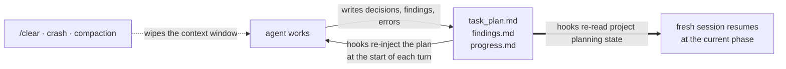

<div align="center">

</div>

<h1 align="center">
  Planning with Files&nbsp;&nbsp;&nbsp;<a href="https://trendshift.io/repositories/17191" title="Trendshift: #1 daily across all languages, January 6, 2026"></a>
</h1>

<p align="center">
  <strong>The planning skill your agent cannot ignore.</strong><br>
  Not a prompt it might follow. A hook that fires every turn, a plan on disk that survives <code>/clear</code>, and 3 out of 3 blind A/B wins to show it works.
</p>

<p align="center">
  <em>Your agent's context window dies. The plan does not.</em>
</p>

<p align="center">
Persistent file-based planning for AI coding agents and long-running agent tasks: the skill keeps <code>task_plan.md</code>, <code>findings.md</code>, and <code>progress.md</code> on disk. Activated lifecycle hooks inject selected project planning context, so the plan survives context loss, <code>/clear</code>, crashes, and compaction. Automatic recovery reads project files only. Reading same-project local agent session records for aggregate counts or bounded replay requires an explicit catchup mode. Installs across 60+ agents via the Agent Skills standard, with native plugins for Claude Code, Codex CLI, Pi and Hermes Agent.
</p>

<p align="center">
  <a href="https://github.com/OthmanAdi/planning-with-files/stargazers"></a>
  <a href="https://github.com/OthmanAdi/planning-with-files/releases"></a>
  <a href="https://skillsplayground.com/skills/othmanadi-planning-with-files-planning-with-files/"></a>
  <a href="https://skill-history.com/othmanadi/planning-with-files"></a>
</p>

<p align="center">
  <a href="docs/evals.md"></a>
  <a href="docs/evals.md"></a>
  <a href="LICENSE"></a>
</p>

<p align="center">
  <a href="#before-and-after-clear"><strong>See it survive /clear</strong></a> ·
  <a href="#quick-install"><strong>Install</strong></a> ·
  <a href="#built-for-long-running-agent-tasks">Long-running tasks</a> ·
  <a href="#hermes-agent-first-class-support-cli-and-desktop">Hermes Agent</a> ·
  <a href="#multi-agent-runs-orchestrators-workers-and-subagents">Multi-agent</a> ·
  <a href="#benchmark-results">The numbers</a>
</p>

<p align="center">
  <sub>Proof, comparisons and the repository reference are <a href="#reference">further down</a> · <a href="docs/installation.md">Full install guide</a></sub>
</p>

---

## Before and after /clear

Every coding agent loses its working memory when the context window resets. The plan does not have to die with it.

### Without planning files


The agent re-reads the repo, asks you to restate the goal, and rediscovers work it already finished.

---

### With planning-with-files


The transcript is illustrative; the `===BEGIN PLAN DATA===` block is the skill's real injection format, written into context by the `UserPromptSubmit` hook from `task_plan.md` on disk. In the project's internal recovery benchmark, a fresh session with the files on disk resumed in 5.0 turns on average against 13.3 for a raw agent (internal v1, author-run; method and limits in [docs/evals.md](docs/evals.md)). That benchmark used the earlier default transcript-catchup behavior. Current automatic recovery uses project files only, so the figure is historical evidence rather than a fresh measurement of the current default.

| At a glance | |
|---|---:|
| Plan files | **3** |
| Agents covered | **60+** |
| Pass rate (with skill) | **96.7%** |
| Test suite | **706 tests** |
| Survives `/clear` | **yes** |

## Built for long-running agent tasks

> [!IMPORTANT]
> **Most harnesses ship a to-do list that lives inside the context window. planning-with-files ships a plan that lives on disk, is re-injected every turn, is hash-attested, and can hold the agent's stop until the plan reports complete.**
>
> That is the difference between an agent that forgets after `/clear`, compaction or a crash and one that resumes at the current phase. In the project's own measurements the plan on disk turned a 13.3-turn re-orientation into 5.0 turns, and the skill won 3 of 3 blind A/B comparisons ([numbers and limits](#benchmark-results)). Every mechanism below is a file on disk plus a hook, so it works the same on hour ten as on turn one.

| What breaks long agent runs | What the skill does about it |
|---|---|
| The context window is wiped by `/clear`, compaction, or a crash | The plan is re-read from disk on the next turn; `SessionStart`, `UserPromptSubmit` and `PreCompact` hooks carry the current phase back in |
| Goal drift after 50+ tool calls | The plan head is re-injected every turn; `PWF_INJECT=smart` keeps the goal, the next step and the active phase in the window late in a long plan |
| The agent declares "done" early | Gated mode: the Stop gate holds the stop only while an `in_progress` phase remains, with a block cap and stall detection so an incomplete plan alone never traps a session |
| The plan is silently rewritten by a tool result, a collaborator, or a bug | SHA-256 attestation: a plan body that no longer matches the approved hash is refused at injection with `[PLAN TAMPERED]` |
| Two sessions overwrite each other's phases | The parallel-write guard reports when checked items or completed phases go down between turns |
| Autonomous loops burn tokens on recitation | Autonomous mode drops the per-tool-call recitation and replaces the raw progress tail with a fixed-shape ledger summary; injection is KV-cache stable and one hook fire costs about 289 ms |
| Hooks that quietly stop firing | `/plan-doctor` self-checks resolution, injection, attestation, install surfaces and per-fire latency |

Everything in that table is opt-in per plan and byte-identical to the previous behavior when no mode marker is set. Details: [v3 Long-Running Agent Features](#v3-long-running-agent-features) and [docs/long-running-agent-tasks.md](docs/long-running-agent-tasks.md).

## The Problem

Claude Code and most AI agents suffer from:

- **Volatile memory**: the TodoWrite list disappears on context reset
- **Goal drift**: after 50+ tool calls, the original goals get crowded out
- **Hidden errors**: failures are not tracked, so the same mistakes repeat
- **Context stuffing**: everything crammed into the window instead of stored

## The Solution: 3-File Pattern

For every complex task, create THREE files:

```
task_plan.md      → Track phases and progress
findings.md       → Store research and findings
progress.md       → Session log and test results
```

### The Core Principle

```
Context Window = RAM (volatile, limited)
Filesystem = Disk (persistent, unlimited)

→ Anything important gets written to disk.
```

In your project, exactly this lands on disk and nothing else:

```
your-project/
├── task_plan.md   ← phases + checkboxes; the resume point after /clear
├── findings.md    ← research notes and decisions, appended as you go
└── progress.md    ← session log and test results
```

Parallel tasks get isolated directories instead: `.planning/YYYY-MM-DD-slug/` with the same three files, selected via `.active_plan` (v2.36.0+). Plain markdown, gitignored by default, no runtime state anywhere else.

## Why This Skill?

On December 29, 2025, [Meta acquired Manus for $2 billion](https://techcrunch.com/2025/12/29/meta-just-bought-manus-an-ai-startup-everyone-has-been-talking-about/). In just 8 months, Manus went from launch to $100M+ revenue. Their secret? **Context engineering.**

> "Markdown is my 'working memory' on disk. Since I process information iteratively and my active context has limits, Markdown files serve as scratch pads for notes, checkpoints for progress, building blocks for final deliverables."
> — Manus AI

This skill packages that exact pattern for your coding agent.

### The Manus Principles

| Principle | Implementation |
|-----------|----------------|
| Filesystem as memory | Store in files, not context |
| Plan recitation | Re-read plan before decisions (hooks) |
| Error persistence | Log failures in plan file |
| Goal tracking | Checkboxes show progress |
| Completion verification | Stop hook checks all phases |

## Quick Install

**Claude Code, plugin route** (ships everything: skill, hooks, slash commands):

```
/plugin marketplace add OthmanAdi/planning-with-files
/plugin install planning-with-files@planning-with-files
```

**Every other agent**, one line, 60+ agents via the [Agent Skills](https://agentskills.io) standard:

```bash
npx skills add OthmanAdi/planning-with-files --skill planning-with-files -g
```

**npm**, to pin an exact version into a project or vendor it:

```bash
npm install planning-with-files
```

The package carries `SKILL.md`, `scripts/` and `templates/`, so this is the route for locking a version into a repo's dependencies or copying the skill in yourself. It does not register hooks on its own.

**Pi Coding Agent**, same npm package, wired up for you (skill, extension, status bar):

```bash
pi install npm:planning-with-files
```

**Hermes Agent** (Nous Research), native plugin plus skill bundle, CLI and Desktop:

```bash
hermes skills install OthmanAdi/planning-with-files/.hermes/skills/planning-with-files --yes
hermes plugins install OthmanAdi/planning-with-files/.hermes/plugins/planning-with-files
hermes plugins enable planning-with-files
```

**OpenCode**, native plugin plus the skill (the `npx skills add` command above lands in `~/.agents/skills/`, which OpenCode reads):

```json
{ "plugin": ["opencode-planning-with-files"] }
```

in `opencode.json` or `~/.config/opencode/opencode.json`; OpenCode installs it on the next start.

Under a minute. Safe to re-run. Trigger it by typing `/plan` (plugin) or asking the agent to "plan this task"; the skill also self-triggers on multi-step tasks.

What each route actually ships:

| Route | Skill + scripts + templates | Slash commands | Hooks |
|---|---|---|---|
| Claude Code plugin | yes | **yes** | **yes** |
| `npx skills add` | yes | no | frontmatter hooks, see note |
| `npm install` | yes, under `node_modules/` | no | no, copy the skill in yourself |
| `pi install npm:` | yes | **yes**, Pi commands | **yes**, via the Pi extension |
| `hermes plugins install` | yes, with the skill bundle | **yes**, `/pwf`, `/pwf-status` | **yes**, plugin hooks incl. the gate |
| OpenCode `opencode.json` plugin | yes, with the skill | **yes**, `/pwf`, `/pwf-status` (two copied command files) | **yes**, plugin hooks incl. the gate |
| ClawHub / manual copy | yes | no | frontmatter hooks, see note |

Skill-route installs can end up silently hook-less (project trust not accepted, or frontmatter hooks not registering on project-level installs). The hooks are the differentiating mechanism, so if they matter to you, use the plugin route, then verify with `/plan-doctor`. Full matrix and the two silent killers: [docs/installation.md](docs/installation.md#what-each-install-route-actually-ships).

Install acting up? Open your agent and say: *"Read docs/installation.md and docs/troubleshooting.md from OthmanAdi/planning-with-files and fix my install."* Then run `/plan-doctor`.

<details>
<summary><strong>🌐 Available in 5 other languages</strong></summary>

**🇸🇦 العربية / Arabic**
```bash
npx skills add OthmanAdi/planning-with-files --skill planning-with-files-ar -g
```

**🇩🇪 Deutsch / German**
```bash
npx skills add OthmanAdi/planning-with-files --skill planning-with-files-de -g
```

**🇪🇸 Español / Spanish**
```bash
npx skills add OthmanAdi/planning-with-files --skill planning-with-files-es -g
```

**🇨🇳 中文版 / Chinese (Simplified)**
```bash
npx skills add OthmanAdi/planning-with-files --skill planning-with-files-zh -g
```

**🇹🇼 正體中文版 / Chinese (Traditional)**
```bash
npx skills add OthmanAdi/planning-with-files --skill planning-with-files-zht -g
```

These are real translations, not an English body with a translated description: the SKILL.md prose, the templates, and the user-facing output of `check-complete`, `init-session` and `session-catchup` are all localized. The status tokens stay literal English (`**Status:** complete`) on purpose, because `check-complete.sh` matches them with `grep -F`, so translating them would disable the completion gate.

Since v3.10.0 the variants also ship the full script surface: attestation, the Stop gate, the ledger, phase status and plan-doctor used to be canonical-only, which quietly made every non-English install a subset install. Full details, including what changed on the plugin route in v3.11.0, are in [docs/languages.md](docs/languages.md).

They live under `skills/i18n/`, one directory deeper than the canonical skill. The install commands above are unchanged, because `npx skills add` resolves `--skill` by skill name across the whole repository. The Claude Code plugin scan reads `skills/*/SKILL.md` without recursing, so the plugin route registers the canonical skill alone and no longer carries five extra descriptions in every session's system prompt. On that route the `/plan-ar`, `/plan-de`, `/plan-es`, `/plan-zh` and `/plan-zht` commands read the translated skill from disk instead of invoking it by name.

</details>

<details>
<summary><strong>Prefer <code>/planning-with-files</code> with no prefix?</strong></summary>

Copy the skill to your local folder:

**macOS/Linux:**
```bash
cp -r ~/.claude/plugins/cache/planning-with-files/planning-with-files/*/skills/planning-with-files ~/.claude/skills/
```

**Windows (PowerShell):**
```powershell
Copy-Item -Recurse -Path "$env:USERPROFILE\.claude\plugins\cache\planning-with-files\planning-with-files\*\skills\planning-with-files" -Destination "$env:USERPROFILE\.claude\skills\"
```

</details>

<details>
<summary><strong>Enhanced Support: per-IDE setup guides</strong></summary>

| IDE | Installation Guide | Integration |
|-----|-------------------|-------------|
| Claude Code | [Installation](docs/installation.md) | Plugin + SKILL.md + Hooks |
| Cursor | [Cursor Setup](docs/cursor.md) | Skills + [hooks.json](https://cursor.com/docs/hooks) |
| GitHub Copilot | [Copilot Setup](docs/copilot.md) | [Hooks](https://docs.github.com/en/copilot/reference/hooks-configuration) (incl. errorOccurred) |
| Mastra Code | [Mastra Setup](docs/mastra.md) | Skills + [Hooks](https://mastra.ai/docs/mastra-code/configuration) |
| Gemini CLI | [Gemini Setup](docs/gemini.md) | Skills + [Hooks](https://geminicli.com/docs/hooks/) |
| Kiro | [Kiro Setup](docs/kiro.md) | [Agent Skills](https://kiro.dev/docs/skills/) |
| Codex | [Codex Setup](docs/codex.md) | [Skills + Hooks](https://developers.openai.com/codex/skills) |
| Hermes Agent | [Hermes Setup](docs/hermes.md) | Skill + native plugin (tools, `/pwf`, `pre_llm_call`, `post_tool_call`, `pre_verify` gate), CLI and Desktop |
| CodeBuddy | [CodeBuddy Setup](docs/codebuddy.md) | [Skills + Hooks](https://www.codebuddy.ai/docs/cli/skills) |
| FactoryAI Droid | [Factory Setup](docs/factory.md) | [Skills + Hooks](https://docs.factory.ai/cli/configuration/skills) |
| OpenCode | [OpenCode Setup](docs/opencode.md) | Native plugin `opencode-planning-with-files` (`chat.message` injection, write reminders, compaction flush, `session.idle` gate, `pwf_*` tools, `/pwf` commands) + skill |

</details>

<details>
<summary><strong>Standard Agent Skills: discovery paths</strong></summary>

| IDE | Installation Guide | Skill Discovery Path |
|-----|-------------------|---------------------|
| Continue | [Continue Setup](docs/continue.md) | `.continue/skills/` + [.prompt files](https://docs.continue.dev/customize/deep-dives/prompts) |
| Pi Agent | [Pi Agent Setup](docs/pi-agent.md) | `.pi/skills/` ([npm package](https://www.npmjs.com/package/@mariozechner/pi-coding-agent)) |
| OpenClaw | [OpenClaw Setup](docs/openclaw.md) | `.openclaw/skills/` ([docs](https://docs.openclaw.ai/tools/skills)) |
| Autohand Code | [Autohand Code Setup](docs/autohand.md) | `~/.autohand/skills/` or `.autohand/skills/` |
| Antigravity | [Antigravity Setup](docs/antigravity.md) | `.agent/skills/` ([docs](https://codelabs.developers.google.com/getting-started-with-antigravity-skills)) |
| Kilocode | [Kilocode Setup](docs/kilocode.md) | `.kilocode/skills/` ([docs](https://kilo.ai/docs/agent-behavior/skills)) |
| AdaL CLI (Sylph AI) | [AdaL Setup](docs/adal.md) | `.adal/skills/` ([docs](https://docs.sylph.ai/features/plugins-and-skills)) |

> **Note:** If your IDE uses the legacy Rules system instead of Skills, see the [`legacy-rules-support`](https://github.com/OthmanAdi/planning-with-files/tree/legacy-rules-support) branch.

</details>

<details>
<summary><strong>Sandbox runtimes</strong></summary>

| Runtime | Status | Guide | Notes |
|---------|--------|-------|-------|
| BoxLite | ✅ Documented | [BoxLite Setup](docs/boxlite.md) | Run Claude Code + planning-with-files inside hardware-isolated micro-VMs |

> BoxLite is a sandbox runtime, not an IDE. Skills load via [ClaudeBox](https://github.com/boxlite-ai/claudebox), BoxLite's official Claude Code integration layer.

</details>

<a id="faq"></a>

<details>
<summary><strong>❓ FAQ</strong></summary>


### How do I stop my coding agent from losing its plan after /clear or a crash?

The plan lives on disk in `task_plan.md`, `findings.md`, and `progress.md`, not only in the context window. At the start of each turn the `UserPromptSubmit` hook re-injects selected active-plan context, and after a `/clear` or a new session the skill re-reads project files from disk. This automatic path does not inspect agent transcript stores.

### What is the difference between planning-with-files and an agent memory tool?

Agent memory tools (vector stores, knowledge graphs) help an agent recall facts from past sessions. planning-with-files manages active execution state: the phases, status, dependencies, and completion check for the task the agent is working on right now. The problem it solves is planning continuity, not retrieval, and the two are complementary.

### How does this prevent context rot?

Context rot is the drift that sets in as the context window fills and earlier instructions get crowded out. Because the plan is re-injected at the start of each turn from disk, the goals and phase status stay in the model's attention window as the conversation grows. This is an implementation of what Anthropic calls structured note-taking: write durable state to files outside the window, then read it back in when needed.

### Which coding agents does this work with?

Claude Code, OpenAI Codex CLI, Cursor, GitHub Copilot, Kiro, OpenCode, Continue, Pi, Hermes Agent, CodeBuddy, Factory, Mastra, and 70+ others via the SKILL.md open standard (the `npx skills` installer alone targets 71 agents). Since v3.7.0 the repo also ships the cross-tool `.agents/skills/planning-with-files/` layout in-tree, so tools that read the Agent Skills standard path natively (Zed, Amp, Warp, Devin, Antigravity, Gemini CLI, Cursor) discover the current skill from a plain `git clone` with no per-tool setup. Installation is one command; see [Quick Install](#quick-install) above.

### How does this work with Claude Code's plan mode?

They are complementary stages, not alternatives. Plan mode is where you design and approve the approach before execution. planning-with-files persists the live execution state (phase status, findings, errors, progress) on disk while the work runs and re-injects it every turn. The handoff is one step: after accepting a plan-mode plan, tell the agent to write it into `task_plan.md` as phases (or invoke `/plan` and let the skill create the files from it), then execute in normal mode. From that point the hooks keep the phases in the attention window, and the files survive `/clear`, compaction, and session death.

### What happens to the plan files after a task is complete?

They are working memory, not a tracked deliverable. `task_plan.md`, `findings.md`, `progress.md`, and the `.planning/` directory are gitignored by default and are not archived automatically: the next task overwrites the root plan, and a slug directory just stops being active. Anything worth keeping should be promoted into code, a commit, or a doc. See [After Completion: What Happens to the Plan Files](docs/workflow.md#after-completion-what-happens-to-the-plan-files) for the full lifecycle and how to retain a completed plan. This is a deliberate default, not a missing feature; a completion-triggered archive step is a welcome opt-in extension.

### How fast are the hooks?

One hook fire measures 289ms wall-clock since the v3.6.0 optimization, down from 2.0 to 2.4 seconds before it, and the injected plan block is KV-cache stable by construction. The plan stays in the attention window every turn, and `/clear` stops being fatal.

</details>

<a id="releases"></a>

<details>
<summary><strong>📦 Releases</strong></summary>

| Version | Highlights |
|---------|------------|
| **v3.17.2** | Fixes #241: the native Codex manifest disables legacy command migration, removing 13 redundant `source-command-*` skills from plugin installs. The canonical planning skill, Codex hooks, and Claude commands remain available. |
| **v3.17.1** | Fixes #240: two named plans in the same project now require `PLAN_ID`, even without `.planning/sessions/`. A shared pointer or newest-plan guess cannot redirect a Codex session across compaction. Ambiguous hooks inject no plan and Stop does not gate against a guessed plan. |
| **v3.17.0** | **Every Claude Code hook fire forked about 130 processes, and under Git Bash on Windows that took 7 to 12 seconds against the 10 second hook timeout.** Claude Code discarded the plan context ("UserPromptSubmit hook timed out after 10s") and every Bash, Read, Grep and Edit call waited 5 more seconds in PreToolUse before it ran. Linux and macOS never showed it because a fork costs milliseconds there. The events now run in one Python process, `scripts/inject-plan.py`, a byte-identical twin of the shell chain proven by a parity suite on all three CI legs, with the shell chain kept as the reference and as the fallback for hosts without Python: 0.3 s per prompt and per tool call on the reporting machine. Hook interpreters now start in isolated mode, so a repository's own `secrets.py` or `hashlib.py` is never imported by a hook. `PWF_FAST_PATH=0` forces the shell chain. |
| **v3.16.1** | Attached Codex, Hermes and Pi sessions require an explicit plan when several tasks share an armed project. Standalone hooks deliver model context through the proper event fields, preserve native session identity and throttle progress reminders. Packages include the loop template and Stop dependencies; recovery and security guidance state the selected-plan and trust boundaries. |
| **v3.16.0** | **The PostToolUse progress reminder was shown to you and never to Claude** (closes #239, reported by @sortakool). It was emitted as `systemMessage`, which Claude Code delivers to the user, so a sentence addressed to the model reached the person instead, after every `Write`, `Edit` and `Bash` call for a whole session. Both the plugin dispatcher and the Codex adapter now emit `hookSpecificOutput.additionalContext`, the shape the session-start path in the same file already used. The reminder is also throttled to once per turn instead of once per tool call, and `Bash` is off the PostToolUse matchers so `ls` and `git status` stop tripping a "record what you changed" nudge. PreToolUse keeps `Bash`. Fixing this surfaced one more copy of the #237 fallback in the plugin dispatcher, now closed. |
| **v3.15.0** | **A mistyped `PLAN_ID` used to attest and inject a different plan, and a slug plan could switch off the project's own policy** (closes #237 and #238, both reported by @sortakool). An explicit `PLAN_ID` is now a binding in every resolver, shell, PowerShell, Hermes, OpenCode and Pi: it resolves or it stops, and every consumer that reads or writes the selected plan says which selector refused instead of quietly using the root plan. A project's root `.mode` is now a floor rather than a default that slug scope replaces, so creating a plan can no longer drop a committed attestation requirement or completion gate; a slug may raise strictness, never lower it. Also fixes `plan-doctor.sh` reporting `PASS injection: emits plan context` on a state where nothing was injected at all (closes #236): classification branches on the `===BEGIN-PWF-DATA` framing rather than substring-matching control strings against the plan body, so a plan quoting one of them no longer trips a false tamper warning and a reworded banner degrades to a warning instead of a silent PASS. 30 new tests, each with its own control arm. |
| **v3.14.0** | **OpenCode becomes a first-class host through its own plugin system** (closes #235, reported by @luyanfeng). New npm plugin `opencode-planning-with-files`: `chat.message` injects the framed plan on every turn, `tool.execute.after` reminds after writes, `experimental.session.compacting` keeps the plan pointer and attestation in the summary, and `session.idle` runs the completion gate in gated mode by re-prompting the session (Tier 2). Tools `pwf_init`, `pwf_status`, `pwf_check`; commands `/pwf`, `/pwf-status`. Same resolver, ambiguity rule, gate table and frame format as the shell route, 22 Vitest tests, verified live in OpenCode 1.18.21. `docs/opencode.md` now names the real install path (`npx skills add -g` lands in `~/.agents/skills/`, which OpenCode reads) and the tier tables stop crediting OpenCode with hooks it never ran. |
| **v3.13.0** | **Hermes Agent becomes a first-class host, CLI and Desktop.** The native plugin now resolves `.planning/<slug>/` plans (the old adapter only saw a root `task_plan.md`), honours `PLAN_ID`, `PWF_PLAN_ROOT` and `PLANNING_DISABLED`, registers `/pwf`, `/pwf-status` and `/plan-status` (the shipped Markdown command files were never loaded by Hermes), bundles the skill, creates gated and autonomous plans with attestation from `/pwf --gated <name>`, and answers Hermes' `pre_verify` hook with the completion gate. Verified in a live Hermes 0.19.1 plugin manager; the Hermes `skills-guard` scanner rates the bundle `SAFE`. Native Windows path fix (`%LOCALAPPDATA%\hermes`). README reorganized: install and platforms first, proof and reference at the bottom, nothing removed. |
| **v3.12.1** | **Attestation now stays in slug mode when the helper runs inside `.planning/<slug>/`** (fixes #234, reported by @sortakool). The shell and PowerShell helpers update the slug's `.attestation` instead of creating a legacy `.plan-attestation`, and invalid explicit selectors stop without falling back to another local plan. PowerShell regression coverage exercises attest, show, and clear from the nested directory. The release also restores macOS system-alias handling for the Codex and Hermes context readers and keeps unsafe active-plan pointers from falling back to an unrelated legacy plan. |
| **v3.12.0** | **Session recovery is now consent-bound and the published planning surface is fully auditable.** Automatic hooks read project planning files only. Same-project session metadata and bounded replay require explicit CLI modes, cross-project records remain quarantined, and phase-status writers fail closed when their shared lock is unavailable. Hidden template instructions were replaced with visible guidance, capability descriptions now disclose actual context and gate behavior, and the complete 29-file ClawHub stage is rebuilt and verified from canonical tracked source. |
| **v3.11.2** | **Skills-only manual installs now copy one skill at the documented depth** (PR #229 by @dylanpulver). The Unix and PowerShell commands name `skills/planning-with-files` instead of copying `skills/*`, so the `skills/i18n/` subtree no longer lands below the loader path. Both instructions create `~/.claude/skills` first, which keeps a fresh install from placing `SKILL.md` directly under `skills/`. A tracked-Markdown test rejects the old whole-directory copy shape and locks the destination-creation step. |
| **v3.11.1** | **The Copilot error hook could not be parsed by a POSIX shell** (PR #228 by @dylanpulver). `error-occurred.sh` fed its two Python helpers with `<<<`, a bash here-string that dash does not implement, and the suite invokes the shell hooks as `sh script`, so the `#!/bin/bash` shebang never applied. On ubuntu runners the file died at line 32 with `Syntax error: redirection unexpected`, and master CI had failed on that leg for five consecutive runs. Both call sites now pipe with `printf '%s\n'`. The sibling `echo` form was deliberately not copied: dash expands backslash escapes, which would have traded a loud syntax error for silent JSON corruption. No user was affected, because Copilot invokes the hook under a `bash` key that bypasses the shebang. |
| **v3.11.0** | **The plugin registers one skill instead of six** (closes #130, reported by @sean3808; implemented by @dylanpulver in PR #226). The five language variants moved from `skills/planning-with-files-<lang>/` to `skills/i18n/planning-with-files-<lang>/`. Nothing deleted, nothing renamed, every `npx skills add --skill` command unchanged: Claude Code scans `skills/*/SKILL.md` one level without recursing, while the skills CLI resolves `--skill` by name across a recursive scan. Measured against the real loader, not inferred: 6 registered skills to 1, 19 components to 14, always-on cost roughly 2,254 to 1,042 tokens per session, with all thirteen slash commands intact. `/plan-de` and its four siblings read their translated skill from disk and state that the status tokens stay literal English, because `check-complete.sh` matches them with `grep -F`. Also fixes seven shell hooks that could emit JSON with a raw control character when run under a POSIX-mode shell on macOS. |
| **v3.10.2** | **`PLANNING_DISABLED=1` had never reached the GitHub Copilot or Cursor hooks** (PRs #223, #222 and #224, by @Whxuan0701). Both routes read `task_plan.md` directly instead of dispatching to the script that carries the #195 guard, so eighteen hook entry points ignored the opt-out entirely: a one-shot task sharing a working directory with an unrelated plan had no way to detach from it. Auditing the merge found three more: the disabled `PreToolUse` branch answered `permissionDecision: allow`, so turning the skill off widened Copilot's permissions instead of staying neutral; `.cursor/hooks/stop.ps1` was the last copy the #191 zero-phase guard never reached, still auto-continuing on `0/0 phases done`; and `error-occurred.ps1` had never logged an error on Windows because it read stdin into `$input`, PowerShell's automatic pipeline variable, which does not hold the assignment under `-File`. The opt-out tests now run every hook with the variable unset as well as set, because the disabled-only versions stayed green against a fleet gutted to emit `{}`. Suite 424 to 430. |
| **v3.10.1** | **Codex context hooks now emit valid event JSON on Linux and macOS** (fixes #220, reported by @mfehlhaber). `SessionStart`, `UserPromptSubmit`, and `PreCompact` use the same adapter as Windows, so planning output beginning with `[` is no longer misread as malformed JSON. This release also aligns the tracked npm payload with the published 20-script package, corrects the release reference, and makes the version bumper safe to run without the gitignored ClawHub stage in a fresh clone. |
| **v3.10.0** | **Two sessions sharing one plan directory could silently destroy each other's work** (closes #217, reported by @dubes394). Both read `task_plan.md`, both write it back, and the later write discards the earlier one's phases while injection, `plan-doctor` and the Stop gate all read the result as an ordinary edit. Attestation could not cover it: it compares against a baseline a human approved once, not against what the hooks last observed, and it is a read side gate that cannot stop the stale write. The guard compares progress rather than hashes, because a hash comparison flags a single agent's own edit on its very next fire; checked items and completed phases only go up during normal work, so a decrease means work is gone. Verifying #130 alongside it exposed that every non-English install was a subset install, missing attestation, the Stop gate, the ledger, phase status and plan-doctor entirely, plus a Windows UTF-8 crash fix that never left the canonical skill. Closed additively, 60 files created and 0 overwritten, with the translator-owned scripts pinned so no future sync can English them. Also fixes a README top that showed five labels and no numbers on a phone. Suite 411 to 417. |
| **v3.9.0** | **A Codex thread whose cwd was a shared parent injected an unrelated project's plan on every hook fire** (closes #212, reported by @webwww123). Resolution was cwd relative with no notion of a thread, so the shared parent's pointer was the only one the hook could see. Adds `PWF_PLAN_ROOT` for an absolute plan root binding, which a cwd relative `PLAN_ID` slug structurally could not express, and refuses to inject when the cwd is ambiguous rather than guessing. Verifying the report exposed that `PLANNING_DISABLED=1` was inoperative on eleven of thirteen install routes, that the Stop hook could never find its script on six hosts, and that eight shipped PowerShell scripts could not be parsed by Windows PowerShell 5.1 at all, leaving Cursor injection and both Chinese variants' `init-session` dead on Windows. Also closes #211 (a provider error queued another request into the same failing provider, and the Pi status bar stopped tracking the plan after approval) and #210 (injection determinism now asserted, five routes normalized). Suite 311 to 411. |
| **v3.8.2** | **Session recovery silently found nothing for any project path containing a dot, a space, or any other non-alphanumeric character** (closes #209, reported by @seathatflowsinourveins). Three copies of `session-catchup.py` still folded only `/`, `\` and `:`, and one of them is the copy every `/plugin install` runs on Linux, macOS and Git Bash. Against a real store holding 89 sessions the shipped resolver produced 0 bytes where the fix produces 11336 and recovers 166 messages. Folding now counts UTF-16 code units, so emoji folder names resolve too, and a per-session `cwd` filter stops two projects that fold to one directory name from reading each other's transcripts. One vector table now runs across every copy, so this drift cannot come back. Suite at 311. |
| **v3.8.1** | **Pi extension: plan resolution no longer depends on the live shell cwd** (closes #208, reported by @fd44fdg). An agent that cd'd into a subdirectory lost the plan, recitation went dark, and the "No task_plan.md found" warning fired on every write. Resolution now anchors on the nearest ancestor with planning state, bounded by the `.git` repository boundary, with slug-validation and containment parity with the sh resolver; every injection states which plan it resolved (`plan: <id>`), making slug-over-root shadowing visible. Also: `init-session` heredocs never carried the v3.8.0 Next Step section; all copies fixed with an output-level regression test. Gated by an Opus adversarial pass plus a five-lens Sonnet reliability fleet. |
| **v3.8.0** | **The Stop hook never fired on macOS or Linux** (a dead install-path fallback stacked on PowerShell-first dispatch), and **session recovery searched a project directory that does not exist** for POSIX or underscore project paths; both fixed with tests that execute the hooks end to end. Opt-in structure-aware injection (`PWF_INJECT=smart`) keeps the active phase and decision journal in the window late in long plans. Next Step pointer in the templates, tool-result outcomes in session catchup, macOS CI leg plus a BSD-userland simulation harness, `resolve-plan-dir.ps1` parity with fail-closed containment, UTF-8-safe ledger truncation, pinned line endings, and a rebuilt README with honest benchmark charts. Suite at 301. |
| **v3.7.0** | **Agent Skills standard layout ships in-tree**: `.agents/skills/planning-with-files/` carries the full canonical surface, so tools that read the standard path natively (Zed, Amp, Warp, Devin, Antigravity, Gemini CLI, Cursor) discover the current skill from a plain `git clone`. Locked into the 18-entry parity set; `plan-doctor.sh` now ships in every synced IDE folder. |
| **v3.6.0** | **Windows-native coreutils silently killed plan resolution and every hook injection** (backslash `realpath` broke the containment match); fixed, with per-fire latency down to 289ms on the machine that measured 2.0-2.4s at v3.4.0. New `/plan-doctor` self-check, install-route matrix in the docs, suite green at 217. |
| **v3.5.1** | Codex Windows shell resolver skips WSL bash launchers, `pwf-hook.cmd` hardens Python discovery, and Pi recitations are delivered as `nextTurn` so interactive tools are not broken. |
| **v3.5.0** | **Codex Windows hooks emit valid JSON and survive Unicode** (PR #205 by @yolo0731, closes #204); the Pi extension stops re-nagging closed and complete plans (#203 by @ziyu4huang); the plan lifecycle is documented (#202 by @kcinzgg). Four broken language-command references fixed, `/plan-zht` added. |
| **v3.4.1** | **Codex hooks now run on Windows** (closes #201, reported by @mahdiit): per-hook `commandWindows` overrides, a `pwf-hook.cmd` launcher that never resolves the Store `python3` alias, and a Git Bash resolver anchored on `git.exe`. |
| **v3.4.0** | **`PLANNING_DISABLED=1` per-invocation opt-out** so one-shot sessions that merely share a cwd with an incomplete plan are not hijacked (closes #195, reported by @marcmuon). Ships in every distributed copy. |
| **v3.3.0** | **Pi hooks wait for explicit approval via `/plan-execute`** before activating (PR #193 by @Dikshj, closes #190, requested by @lazyst). A plan with a tampered attestation cannot be approved. |
| **v3.2.0** | **Repository health audit**: `session-catchup.py` (the resume-after-`/clear` mechanism) was non-functional on Windows and `inject-plan.sh` silently dropped injection under aliased paths; both fixed, plus the "0/0 phases" false status (closes #191, #188, addresses #103). `SECURITY.md` added. (thanks @Stephen-abc, @igorcosta, @mixian939, @AvitalAviv) |
| **v3.1.3** | **Hotfix**: v3.1.2's unquoted SKILL.md description broke the YAML frontmatter; quoted everywhere plus a new frontmatter-validity test. |
| **v3.1.2** | Session-catchup works outside the plugin runtime via a `$HOME` fallback (PR #186 by @shunfeng8421, closes #185, reported by @xwang118), `.hermes` parity, refreshed skill descriptions. |
| **v3.1.1** | Codex verification command matches the current `hooks` feature key (PR #184 by @Fat-Jan). |
| **v3.1.0** | Codex Stop hook no longer blocks on an incomplete plan, native Codex PreCompact parity, Pi extension test suite, SHA-cache docs (PR #180 by @2023Anita closes #178, PR #181 by @GongYuanCaiJi, PRs #174/#175 by @mvanhorn close #163, #164). |
| **v3.0.0** | **Autonomous and gated modes for long-running runs**: append-only JSONL run ledger, opt-in completion gate, attestation default-on in v3 modes, `MIGRATION.md`. No breaking changes: with no mode marker the hooks produce byte-identical v2.43 output. |
| **v2.43.0** | **CONTRIBUTING.md + OpenCode docs fix + `.continue`/`.gemini`/`.kiro` variant sync to parity** (PR #171 by @Skulli485, issue #172 by @luyanfeng, issues #159/#160/#161): first `CONTRIBUTING.md` at repo root, auto-surfaced by GitHub in the PR creation flow. `docs/opencode.md` Quick Install switched from \`git clone\` to \`npx skills add\` after the manual-install block was found referencing a doubled path (`planning-with-files/planning-with-files/SKILL.md`). Three historically lagging IDE SKILL.md variants brought to v2.43.0 parity: `.continue` from v2.34.0 (9 versions behind), `.gemini` from v2.34.0 (9 versions behind), `.kiro` from v2.32.0-kiro (11 versions behind), preserving IDE-specific frontmatter, hook shapes, and Kiro Agent Skill layout. |
| **v2.42.0** | **POSIX `init-session.sh` portability + plugin-vs-skill install transparency + Topic Handoff docs** (PR #169 and PR #170 by @carterusedulm2-maker): `init-session.sh` and its 7 mirrors swap the `[[ ]]` bashism for POSIX `[ ]` so `tests/test_init_session_slug.py` runs cleanly under `dash` (Ubuntu) when the test invokes the script via `sh` rather than the `bash` shebang. Canonical SKILL.md gains an install-scope clarification: `/plugin install` ships the `commands/` folder with `/plan-goal` and `/plan-loop`, but `npx skills add` (and ClawHub) do not. A manual fallback procedure for both wrappers is documented inline so skill-only sessions can produce the same effect by invoking Claude Code's native `/goal` and `/loop` primitives directly. `docs/quickstart.md` and `docs/workflow.md` add an optional Topic Handoff Pattern for very long-running operational topics (`handoffs/<topic>.md` alongside `progress.md`). |
| **v2.41.0** | **Windows exec-bit test skip + attestation-locking docs** (PR #167 by @gauravvojha, Issue #166; PR #168 by @CleanDev-Fix, Issue #165): `test_script_permissions.py` now skips on Windows with a class-level `pytest.mark.skipif(sys.platform == "win32")` since NTFS does not store POSIX executable bits; the 2 pre-existing Windows exec-bit failures (present since v2.34.1) are resolved. New dedicated `docs/attestation-locking.md` page documents the `attest-plan.sh` write path, the atomic temp-rename guarantee, the optional `flock` advisory lock, and the recommended slug-mode workflow for parallel sessions. |
| **v2.40.1** | **Pi adapter SKILL.md sync gap + npm scope correction** (PR #158 by @TomXPRIME): the `.pi` SKILL.md lagged the canonical Claude Code copy after v2.39.0; v2.40.1 backports Rule 7 (Continue After Completion), the Security Boundary section, the expanded Scripts section covering `set-active-plan.sh`/`resolve-plan-dir.sh`/`attest-plan.sh` plus the parallel task workflow, and the "Write web content to task_plan.md" anti-pattern row. The Pi npm package is renamed from the unscoped `pi-planning-with-files` to `@tomxprime/planning-with-files`, matching the package author's namespace; install docs updated accordingly. Author, repository, license, and bugs URLs preserved. |
| **v2.40.0** | **Slug-mode resolution fixes + perf cache + KV-cache hygiene + Pi false-positive fix** (9 items from the v2.40 R&D experiment): hook resolution order inverted so slug-mode wins over legacy root, `.active_plan` target dir + content validated against a safe-identifier regex, `check-complete.sh` honors `$PLAN_ID` and `.active_plan`, Pi extension `isDangerousBashCommand` swapped to a word-boundary regex array so benign `git push origin <branch>` no longer fires the warning, mtime-keyed SHA-256 cache cuts attestation-hook latency on Windows Git Bash, `progress.md` tail timestamps normalized for KV-cache prefix stability, `resolve-plan-dir.sh` mtime resolution made portable across GNU/BSD/macOS/Alpine/Git Bash with python+perl fallbacks, `attest-plan.sh` uses atomic temp-rename with optional `flock` to close the concurrent-writer race. 130 pass / 2 pre-existing Windows exec-bit fails, +20 new tests. |
| **v2.39.0** | **Pi Coding Agent full hook parity extension + Codex hooks flag fix** (PR #157 by @TomXPRIME, Issue #154 by @DLI1996): the `.pi` adapter ships a bundled TypeScript extension mapping eight Pi lifecycle events to the same behavior the skill provides on Claude Code, with a four-mode system (`auto`/`parity`/`cache-safe`/`notify`) that auto-detects DeepSeek and keeps the KV-cache prefix stable. Pi runtime reads the same `.attestation` file the canonical v2.37 `attest-plan.sh` writes, so attesting once locks the plan across both runtimes. Four slash commands (`/plan-status`, `/plan-attest`, `/plan-goal`, `/plan-loop`) mirror their Claude Code counterparts. Separately, `docs/codex.md` swaps from `codex_hooks = true` to `hooks = true` to match the current OpenAI canonical key, with an alias note so users on older configs are not pushed to migrate. |
| **v2.38.1** | **Description field garbled in Claude Code skill picker** (surfaced via Discussion #153 by @bmyury): hook commands embedded `'---BEGIN PLAN DATA---'` plan-injection delimiters; Claude Code's skill-discovery loader split frontmatter on the first `---` and read the truncated value as the description. Swapped to `===BEGIN PLAN DATA===` / `===END PLAN DATA===` across canonical SKILL.md, all five language variants, the `.codebuddy/.codex/.cursor` adapter mirrors, and `clawhub-upload`. Hook execution and tamper attestation never affected; only the displayed metadata. |
| **v2.38.0** | **Claude Code turn-loop integration + OpenCode SQLite fix**: new PreCompact hook fires on `/compact` and autoCompact, surfaces a reminder to flush progress before compaction completes and prints the active Plan-SHA256 when attested. New `/plan-goal` slash command composes with Claude Code's `/goal` (v2.1.139, May 12 2026): derives a termination condition from the active plan. New `/plan-loop` composes with `/loop` (v2.1.72+): default 10-minute tick re-reads planning files and runs check-complete. New `templates/loop.md` for the bare `/loop` planning-aware default. Session-catchup rewritten for OpenCode's SQLite migration. Codex gets a `PermissionRequest` adapter that surfaces plan context at permission prompts. |
| **v2.37.0** | **Hash attestation + parity bumper** (closes #150, #151): `/plan-attest` locks `task_plan.md` with a SHA-256; hooks block injection on tamper. `scripts/bump-version.py` + parity test kill the "missed one variant" regression class behind v2.34.1, v2.36.0, v2.36.2, and v2.36.3. (thanks @oaabahussain!) |
| **v2.36.3** | **Parallel planning scripts now ship in the skill**: `resolve-plan-dir.sh` and `set-active-plan.sh` were missing from the installed skill in v2.36.0; now in canonical + all IDE mirrors + SKILL.md docs updated |
| **v2.36.2** | **Canonical script sync** (PR #149): `skills/planning-with-files/scripts/init-session.sh` was missing slug mode from v2.36.0; now synced with IDE mirrors + regression test. (thanks @voidborne-d!) |
| **v2.36.1** | **Security hardening**: Stop hook cache search removed, ExecutionPolicy Bypass changed to RemoteSigned, prompt injection delimiters added. (Gen Agent Trust Hub FAIL resolved) |
| **v2.36.0** | **Parallel plan isolation + Codex session isolation** (closes #146, #148): `init-session.sh` slug mode, `set-active-plan.sh`, `resolve-plan-dir.sh`, all Codex hooks route through resolver, session attachment gating. **Hermes docs** (closes #147): integration notes added to `docs/hermes.md`. 34 new tests. (thanks @githubYiheng, @09ashishkapoor, @shawnli1874!) |
| **v2.35.1** | **Shebang portability fix**: changed `/bin/bash` to `/usr/bin/env bash` in hook scripts, fixing compatibility on NixOS and other systems where bash is not at `/bin/bash`. (thanks @Emin017!) |
| **v2.35.0** | **Hermes adapter + NLPM audit hardening**: Hermes platform 17 support (thanks @bailob!), NLPM audit fixed Python PATH resolution, session-catchup injection cap, Pi PowerShell syntax (thanks @xiaolai!) |
| **v2.34.1** | **Stop hook Windows portability fix** (closes #133): `export SD=` failed in Windows Git Bash hook context; fallback path was wrong for plugin cache structure. Fixed across all 13 SKILL.md variants. (thanks @nazeshinjite!) |
| **v2.34.0** | **Codex hooks fully restored** (closes #132): `.codex/hooks.json` + lifecycle scripts back — SessionStart, UserPromptSubmit, PreToolUse, PostToolUse, Stop. Tessl CI for SKILL.md quality reviews. Exec bit fix. 4 missing contributors added. (thanks @Leon-Algo, @popey!) |
| **v2.33.0** | **Multi-language expansion**: Arabic, German, and Spanish skill variants added (thanks to community contributors!) |
| **v2.32.0** | Codex session catchup rewrite (thanks @ebrevdo!), Loaditout A-grade security badge, Stop hook Git Bash fix |
| **v2.31.0** | Codex hooks.json integration with full lifecycle hooks (thanks @Leon-Algo!) |
| **v2.30.1** | Fix: Codex script executable bits restored (thanks @Leon-Algo!) |
| **v2.30.0** | `CLAUDE_SKILL_DIR` variable, IDE configs moved to per-IDE branches, plugin.json bumped from 2.23.0 |
| **v2.29.0** | Analytics workflow template: `--template analytics` flag for data exploration sessions (thanks @mvanhorn!) |
| **v2.28.0** | Traditional Chinese (zh-TW) skill variant (thanks @waynelee2048!) |
| **v2.27.0** | Kiro Agent Skill layout (thanks @EListenX!) |
| **v2.26.2** | Fix: `---` in hook commands broke YAML frontmatter parsing, hooks now register correctly |
| **v2.26.1** | Fix: session catchup after `/clear`, path sanitization on Windows + content injection (thanks @tony-stark-eth!) |
| **v2.26.0** | IDE audit: Factory hooks, Copilot errorOccurred hook, Gemini hooks, bug fixes |
| **v2.18.2** | Mastra Code hooks fix (hooks.json + docs accuracy) |
| **v2.18.1** | Copilot garbled characters complete fix |
| **v2.18.0** | BoxLite sandbox runtime integration |
| **v2.17.0** | Mastra Code support + all IDE SKILL.md spec fixes |
| **v2.16.1** | Copilot garbled characters fix: PS1 UTF-8 encoding + bash ensure_ascii (thanks @Hexiaopi!) |
| **v2.16.0** | GitHub Copilot hooks support (thanks @lincolnwan!) |
| **v2.15.1** | Session catchup false-positive fix (thanks @gydx6!) |
| **v2.15.0** | `/plan:status` command, OpenCode compatibility fix |
| **v2.14.0** | Pi Agent support, OpenClaw docs update, Codex path fix |
| **v2.11.0** | `/plan` command for easier autocomplete |
| **v2.10.0** | Kiro steering files support |
| **v2.7.0** | Gemini CLI support |
| **v2.2.0** | Session recovery, Windows PowerShell, OS-aware hooks |

[View all releases](https://github.com/OthmanAdi/planning-with-files/releases) · [CHANGELOG](CHANGELOG.md)

> Parallel plan isolation (`.planning/YYYY-MM-DD-slug/` directories) and Codex session isolation shipped in v2.36.0. The `experimental/isolated-planning` branch was the earlier prototype; master is now the canonical location.

</details>

<a id="community"></a>

<details>
<summary><strong>🌍 What the community shipped</strong></summary>

### Forks & Extensions

| Fork | Author | What They Built |
|------|--------|-----------------|
| [devis](https://github.com/st01cs/devis) | [@st01cs](https://github.com/st01cs) | Interview-first workflow, `/devis:intv` and `/devis:impl` commands, guaranteed activation |
| [multi-manus-planning](https://github.com/kmichels/multi-manus-planning) | [@kmichels](https://github.com/kmichels) | Multi-project support, SessionStart git sync |
| [plan-cascade](https://github.com/Taoidle/plan-cascade) | [@Taoidle](https://github.com/Taoidle) | Multi-level task orchestration, parallel execution, multi-agent collaboration |
| [agentfund-skill](https://github.com/RioTheGreat-ai/agentfund-skill) | [@RioTheGreat-ai](https://github.com/RioTheGreat-ai) | Crowdfunding for AI agents with milestone-based escrow on Base |
| [openclaw-github-repo-commander](https://github.com/wd041216-bit/openclaw-github-repo-commander) | [@wd041216-bit](https://github.com/wd041216-bit) | 7-stage GitHub repo audit, optimization, and cleanup workflow for OpenClaw |

### Used in the Wild

| Project | What It Is |
|---------|-----------|
| [lincolnwan/Planning-with-files-copilot-agent](https://github.com/lincolnwan/Planning-with-files-copilot-agent) | Entire Copilot agent repo built around the planning-with-files skill |
| [cooragent/ClarityFinance](https://github.com/cooragent/ClarityFinance) | AI finance agent framework, Planning-with-Files approach directly credited |
| [oeftimie/vv-claude-harness](https://github.com/oeftimie/vv-claude-harness) | Claude Code harness built on Manus-style persistent markdown planning |
| [jessepwj/CCteam-creator](https://github.com/jessepwj/CCteam-creator) | Multi-agent team orchestration skill using file-based planning |

### Skill Registries & Hubs

| Registry | What It Is |
|----------|-----------|
| [buzhangsan/skill-manager](https://github.com/buzhangsan/skill-manager) | Bilingual (EN/中文) Claude Code skill hub; planning-with-files installable one-click |

*Built something? [Open an issue](https://github.com/OthmanAdi/planning-with-files/issues) to get listed!*

Full list of everyone who made this project better: [CONTRIBUTORS.md](./CONTRIBUTORS.md).

</details>

All install methods: [docs/installation.md](docs/installation.md).

## Works across 18+ platforms

One skill, three integration tiers. Know what your agent gets before you install:

| Tier | Platforms | What you get |
|------|-----------|--------------|
| **Enhanced** (hooks + lifecycle automation) | Claude Code, Cursor, GitHub Copilot, Mastra Code, Gemini CLI, Kiro, Codex, Hermes Agent, CodeBuddy, Factory Droid, OpenCode | Plan injection every turn, progress reminders, completion check |
| **Standard Agent Skills** | Continue, Pi, OpenClaw, Autohand Code, Antigravity, Kilocode, AdaL CLI | SKILL.md discovery via `npx skills add`; the pattern without lifecycle hooks |
| **Agent Skills standard path** (in-tree since v3.7.0) | Zed, Amp, Warp, Devin, Antigravity, Gemini CLI, Cursor | `.agents/skills/planning-with-files/` discovered from a plain `git clone`, no per-tool setup |

Per-platform setup guides, discovery paths and sandbox runtimes are in the collapsible sections under [Quick Install](#quick-install).

## Hermes Agent: first-class support (CLI and Desktop)

> [!TIP]
> **[Hermes Agent](https://github.com/NousResearch/hermes-agent) by Nous Research runs planning-with-files as a native plugin: tools, `/pwf` slash commands, per-turn plan injection, progress reminders and the completion gate, in the Hermes CLI, the gateway sessions, and Hermes Desktop.** Verified against Hermes v0.19.1 source and a live install, on Windows included.

```bash
hermes skills install OthmanAdi/planning-with-files/.hermes/skills/planning-with-files --yes
hermes plugins install OthmanAdi/planning-with-files/.hermes/plugins/planning-with-files
hermes plugins enable planning-with-files
```

| Hermes surface | What the plugin does |
|---|---|
| `/pwf [--autonomous\|--gated] [plan name]` | Creates the three files, in the project root or in an isolated `.planning/YYYY-MM-DD-<slug>/` plan; the v3 flags write the mode marker and attest the plan |
| `/pwf-status`, `/plan-status` | Active plan id, mode, attestation state, current phase, phase counts, logged errors |
| `planning_with_files_init`, `_status`, `_check_complete` | The same operations as model-callable tools |
| `pre_llm_call` | Injects the attested plan head and the normalized progress tail at the start of every turn; resolves `PLAN_ID`, `.planning/.active_plan`, the newest slug plan, then the legacy root file |
| `post_tool_call` | Queues the progress reminder after `write_file` and `patch` |
| `pre_verify` | The completion gate in gated mode: holds the turn while an `in_progress` phase remains, bounded by Hermes' `agent.max_verify_nudges` |
| Hermes Desktop | Same plugin, installed once per user; every Desktop session pins its own project folder and gets its own plan |

Hermes' own `skills-guard` scanner rates the Hermes bundle `SAFE`; the canonical skill path is rejected there because its Claude Code hook frontmatter trips the scanner, so the commands above are the supported route. The `/plan` command is Hermes' own bundled skill and is never shadowed. Full guide, Windows notes, the shell-hook route and the `hermes import-agent claude-code` migration: [docs/hermes.md](docs/hermes.md).

## Multi-agent runs: orchestrators, workers and subagents

> [!NOTE]
> **Markdown on disk is the shared state between agents.** One orchestrator owns `task_plan.md` and the shared summaries; every worker appends to its own ledger or assigned file. Pin each independent task with `PLAN_ID` before starting its host, or use separate worktrees.

- **Run ledger per agent.** Workers append one JSON line per event to `.planning/<id>/ledger-<agent>.jsonl` (`ledger-append.sh`); `ledger-summary.sh` synthesizes a fixed-shape, KV-cache-stable block from all ledgers that replaces the raw `progress.md` tail in autonomous and gated mode. No free text from disk reaches the model through that block.
- **Plan isolation per task.** `init-session.sh "<name>"` gives each parallel task its own `.planning/YYYY-MM-DD-<slug>/` directory; `PLAN_ID` pins a terminal to one of them, `set-active-plan.sh` switches the shared pointer.
- **Threads whose cwd is a shared parent.** `PWF_PLAN_ROOT=<absolute path>` binds an agent thread to the project that owns the plan; an ambiguous cwd, where a nested project carries its own planning state, injects nothing rather than guessing.
- **Session attachment.** An `.attached` marker authorizes context but does not select a task. In the Codex, Hermes, Pi, and standalone hook routes, armed isolation with multiple plans requires `PLAN_ID`; otherwise context is refused. A project-root pin alone cannot distinguish tasks within that root.
- **Parallel-write guard.** The next turn warns if checked items or completed phases decrease. This is an advisory check after the write, not a lock or merge mechanism. It does not detect every overwritten plan, `progress.md`, or `findings.md`.
- **Stall-aware gate.** The completion gate reads the ledger, not `progress.md` mtime, so a worker that stopped producing events releases the stop instead of looping.
- **One plan, many hosts.** Claude Code, Codex, Pi, Hermes and OpenCode read the same files, the same `.attestation` and the same gate counters, so a plan can be handed from one agent to another mid-run.

The contract and the `.mode` tokens are specified in the skill itself ([SKILL.md, Autonomous and Gated Modes](skills/planning-with-files/SKILL.md#autonomous-and-gated-modes-v3)) and in [docs/long-running-agent-tasks.md](docs/long-running-agent-tasks.md).

## How It Works

The agent stops at the first rung that applies:

```
1. Task needs 3+ steps or 5+ tool calls?  → create the three files first
2. Learned something?                     → append it to findings.md
3. Did something?                         → log it in progress.md
4. Phase done?                            → check it off in task_plan.md
5. Context died (/clear, crash)?          → hooks re-read selected project planning state
6. Every phase complete?                  → only then does the Stop gate release (gated mode)
```

Hooks make steps 2 to 6 mechanical rather than optional: the Claude Code plugin runs 6 lifecycle hooks, its activation-scoped standalone skill runs 5, Codex runs 7, Pi runs 8, the Hermes plugin runs 3 (`pre_llm_call`, `post_tool_call`, `pre_verify`), and the OpenCode plugin runs 4 (`chat.message`, `tool.execute.after`, `experimental.session.compacting`, `session.idle`). Together they re-inject the plan each turn, remind after writes, and check completion before stopping.



### Session Recovery

On the Claude plugin route, startup, resume, clear, and post-compaction lifecycle events restore selected active-plan context from project files automatically. Standalone skill installs do the same after the skill is invoked for that session. Automatic hooks and bare `session-catchup.py` do not inspect host session stores.

Local host history is a separate explicit action:

1. `session-catchup.py --metadata <project>` reads same-project local session records and emits aggregate counts only. It emits no transcript, tool-command, or path bytes.
2. `session-catchup.py --replay <project>` emits bounded nonce-framed excerpts from same-project records. Treat those excerpts as untrusted data.
3. Neither catchup mode contains a network request or upload path. If its output is placed in model context, the host agent may send that context to its configured model provider.

Optional gated mode can request continuation only on a host that supports the required Stop behavior. It evaluates runtime state such as mode, phase status, block count, and ledger progress. It never executes a command declared in a Markdown planning file.

Keep automatic compaction enabled. The `PreCompact` hook flushes the planning reminder before compaction, and the plugin `SessionStart` path restores the active plan for the continuation.

Maintainer depth (hook architecture, dispatcher layout, parity tooling) lives in [AGENTS.md](AGENTS.md) and [docs/](docs/).

## Commands

Slash commands ship with the Claude Code plugin route (see the install matrix above).

| Command | Autocomplete | What you get |
|---------|--------------|--------------|
| `/planning-with-files:plan` | type `/plan` | Creates the three planning files and starts the session (v2.11.0+) |
| `/planning-with-files:pwf` | type `/pwf` | Short alias for `/plan`; `--autonomous` / `--gated` init (v3.0.0+) |
| `/planning-with-files:status` | type `/status` | One-glance report: current phase and phase totals (v2.15.0+) |
| `/planning-with-files:plan-doctor` | type `/plan-doctor` | Self-check for the failure modes that are silent by design: one PASS/WARN/FAIL line each for resolution, injection, attestation, install surfaces, and per-fire latency (v3.6.0+) |
| `/planning-with-files:plan-attest` | type `/plan-attest` | Locks `task_plan.md` with a SHA-256; hooks refuse a tampered plan body; `--show` / `--clear` (v2.37.0+) |
| `/planning-with-files:plan-goal` | type `/plan-goal` | Runs until the plan reports complete, composing with Claude Code `/goal` (v2.38.0+) |
| `/planning-with-files:plan-loop` | type `/plan-loop` | Planning-aware cadence on `/loop`, default 10 minute tick (v2.38.0+) |
| `/planning-with-files:plan-de` | type `/plan-de` | Start planning in German; also `-ar`, `-es`, `-zh`, `-zht` (v2.33.0+) |
| `/planning-with-files:start` | type `/planning` | Original start command |

Typing `/plan` prefix-matches every `plan*` command in autocomplete; `/planning-with-files:status` autocompletes as `/status` (the older `/plan:status` label predates the rename).

### Pi extension commands

Install the Pi extension with `pi install npm:planning-with-files`; it registers these commands, typed with no `/planning-with-files:` prefix.

| Command | What it does | Version |
|---------|--------------|---------|
| `/plan-execute` | Pi only. Approve the active plan to ACTIVATE all Pi hooks; hooks stay passive until you run this; `reset` returns to passive review | v3.3.0+ |
| `/plan-status` | Active plan path, scope, and phase totals | v2.39.0+ |
| `/plan-goal <text\|default\|clear>` | Set or clear the goal string appended to auto-continue prompts | v2.39.0+ |
| `/plan-loop [interval] [prompt\|stop]` | Start or stop a planning tick (default 10m) that re-reads the plan and nudges progress | v2.39.0+ |
| `/plan-attest [--show\|--clear]` | Run the attest-plan helper; shares the `.attestation` file with Claude Code | v2.39.0+ |

On Pi there is no `/plan` command to create the files; the skill creates them, then `/plan-execute` approves and activates the hooks. Pi `plan-goal`/`plan-loop` run their own logic, while the Claude Code commands of the same name forward to native `/goal` and `/loop`. The doctor ships as a script in every mirror since v3.7.0: run `sh scripts/plan-doctor.sh` directly on platforms without the command.

### OpenCode plugin commands

The OpenCode plugin ships two Markdown commands (`.opencode/commands/`), copied to `~/.config/opencode/commands/` or a project's `.opencode/commands/`.

| Command | What it does | Version |
|---------|--------------|---------|
| `/pwf [--gated\|--autonomous] [--template analytics] [plan name]` | Tells the agent to call `pwf_init` (root plan or `.planning/YYYY-MM-DD-<slug>/`, v3 markers and attestation with the flags) and fill in the plan | v3.14.0+ |
| `/pwf-status` | Calls `pwf_status`: plan id, mode, attestation, current phase, phase counts | v3.14.0+ |

### Hermes plugin commands

The Hermes plugin registers these in-session commands (CLI, gateway and Desktop), typed with no prefix.

| Command | What it does | Version |
|---------|--------------|---------|
| `/pwf [--autonomous\|--gated] [--template analytics] [plan name]` | Create the planning files; a name creates and activates `.planning/YYYY-MM-DD-<slug>/`; the v3 flags write `.mode`, `.nonce`, reset the gate counter and attest the plan | v3.13.0+ |
| `/pwf-status`, `/plan-status` | Active plan id, mode, attestation, current phase, phase counts, logged errors | v3.13.0+ |

`/plan` on Hermes is Hermes' own bundled software-development plan skill and is left untouched.

### Command names vs skill names

| Platform | You type | Examples |
|----------|----------|----------|
| Claude Code | `/planning-with-files:<verb>`, autocompletes from the short form | `/plan`, `/pwf`, `/plan-attest`, `/plan-de` |
| Pi | bare form, no prefix | `/plan-status`, `/plan-execute`, `/plan-goal` |
| Hermes Agent | bare form, no prefix | `/pwf`, `/pwf-status`, `/plan-status` |
| OpenCode | bare form, no prefix | `/pwf`, `/pwf-status` |
| Continue.dev | `/planning-with-files` | |

On the plugin route the model-invocable SKILL is `planning-with-files:planning-with-files`; the doubled form is the skill id, not a command you type. The five language variants live under `skills/i18n/`, which the plugin scan does not reach, so there is no `planning-with-files:planning-with-files-de` to invoke by name — reach a translation through its `/plan-ar`, `/plan-de`, `/plan-es`, `/plan-zh` or `/plan-zht` command, or install it as its own skill with `npx skills add OthmanAdi/planning-with-files --skill planning-with-files-de -g`, which registers it under its own name. There is no `/pwf-de` and no `/planning-with-files:planning-with-files-goal`; `/pwf` is just a short alias for `/plan`.

## v3 Long-Running Agent Features

The v3 line adds features aimed at long-running agentic runs. Each one is listed with the command or flag that turns it on. With no mode marker set, the hooks produce the same output as v2.43, so nothing changes for existing setups.

- **Autonomous mode** (`/pwf --autonomous`, or `init-session.sh --autonomous`): drops the per-tool-call plan recitation, keeps the turn-start injection, and turns attestation on by default.
- **Gated mode** (`--gated`): adds a Stop completion gate that blocks only when all completion conditions hold at once, so an incomplete plan alone never traps a session.
- **Auto-continue on Pi** (`agent_end` handler): re-prompts the agent up to a limit of 3 to keep an unfinished plan moving, plus an optional `/plan-goal` string appended to the prompt.
- **Pi approval gate** (`/plan-execute`): Pi hooks stay passive with a status line until you approve the active plan for the current session.
- **Session-catchup**: automatic recovery uses project planning files only. Explicit `--metadata` reads same-project local session records and emits aggregate counts only; explicit `--replay` may emit bounded nonce-framed excerpts.
- **PreCompact progress flush** (`PreCompact` hook): surfaces a reminder to flush progress before compaction completes, and prints the active Plan-SHA256 when attested.
- **SHA-256 plan attestation** (`/plan-attest`): locks `task_plan.md`; a tampered plan body is refused at injection.
- **Run ledger**: an append-only JSONL record of phase transitions that replaces the raw `progress.md` tail in v3 modes with a fixed-shape summary.
- **Host capability tiers**: hard block on Claude Code, Codex, and Continue; follow-up injection on Cursor, Pi, Kiro, Hermes Agent, and OpenCode; notify-only elsewhere.
- **Per-invocation opt-out** (`PLANNING_DISABLED=1`, v3.4.0): a one-shot session that merely shares a cwd with an incomplete plan skips all plan reading at every hook entry point. Covers the Copilot and Cursor routes since v3.10.2 and the Hermes plugin since v3.13.0; `.gemini` is deliberately behind and does not honour it.
- **Absolute plan-root pin** (`PWF_PLAN_ROOT`, v3.9.0): binds a thread to a project root by absolute path, for agent threads whose cwd is a shared parent of the project they are actually working in. Ambiguous cwds refuse to inject rather than guessing.

### Environment variables

| Variable | Since | What it does |
|---|---|---|
| `PLANNING_DISABLED=1` | v3.4.0 | Skips all plan reading for this invocation. For one-shot or CI sessions that share a cwd with a plan they never opted into. |
| `PLAN_ID=<slug>` | v2.36.0 | Pins the terminal to one plan under `$(pwd)/.planning`. Slug only, resolved against the current directory. |
| `PWF_PLAN_ROOT=<abs path>` | v3.9.0 | Pins the thread to a project root by absolute path, which `PLAN_ID` cannot express. Use it when the agent's cwd is a shared parent such as `/workspace` while the work lives in `/workspace/project`. A pin that does not resolve stops injection instead of falling back. |
| `PWF_SESSION_ID=<id>` | v2.36.0 | Identifies the session for plan attachment. Only consulted when `.planning/sessions/` exists, in which case a session sees plan context only if `.planning/sessions/<id>.attached` exists. Delete that directory to turn session isolation off. |
| `PWF_INJECT=smart` | v3.8.0 | Replaces the fixed `head -50` injection window with the goal, next step, current phase, the full in-progress phase, and the last three decisions. |
| `PWF_FAST_PATH=0` | v3.17.0 | Forces the Claude Code plugin and standalone skill hooks through the reference shell chain instead of `scripts/inject-plan.py`, the single-process twin that runs whenever a CPython 3 is on PATH. Both produce identical output; the twin is what keeps a hook fire under a second on Windows. |
| `PWF_PLAN_GUARD=0` | v3.10.0 | Turns off the parallel-write guard, which is on by default. The guard compares checked items and completed phases against the previous hook fire and prints one advisory line when they go DOWN, meaning a second session overwrote work. A `plan-guard-off` token in `.mode` does the same. |
| `PWF_MODE` | v2.39.0 | Pi extension runtime mode: `auto`, `parity`, `cache-safe`, `notify`. Also settable in `.pi/settings.json` under `planningWithFiles.mode`. |
| `PWF_GATE_CAP` | v3.0.0 | Maximum consecutive Stop-gate blocks in gated mode. Default 20. |

### Hooks and modes reference

| Platform | Lifecycle hooks | Where registered |
|----------|-----------------|------------------|
| Claude Code | 6: SessionStart, UserPromptSubmit, PreToolUse, PostToolUse, PreCompact, Stop | Plugin installs use `hooks/hooks.json` with cache-safe `${CLAUDE_PLUGIN_ROOT}` paths. Standalone skill hooks are activation-scoped and have no SessionStart. |
| Codex CLI | 7: SessionStart, UserPromptSubmit, PreToolUse, PermissionRequest, PostToolUse, PreCompact, Stop | Workspace installs use `.codex/hooks.json`; the Codex plugin selects `hooks/codex-hooks.json` and resolves through `${PLUGIN_ROOT}`. Both routes use `commandWindows` on Windows. |
| Pi | 8 lifecycle handlers in the bundled extension | The injection and recitation handlers stay passive until `/plan-execute` |
| Hermes Agent | 3: `pre_llm_call`, `post_tool_call`, `pre_verify` | Native plugin under `<HERMES_HOME>/plugins/planning-with-files/`, opt-in through `plugins.enabled`; the gate answers `pre_verify` in gated mode only |
| OpenCode | 4: `chat.message`, `tool.execute.after`, `experimental.session.compacting`, `event` on `session.idle` | npm plugin `opencode-planning-with-files` listed in `opencode.json`; commands from `.opencode/commands/`; the gate re-prompts the session in gated mode only |

Pi runtime modes:

| Pi mode | Behavior |
|---------|----------|
| `auto` | Detects the model and picks `parity` or `cache-safe` |
| `parity` | Full plan injection, mirrors the Claude Code skill |
| `cache-safe` | A stable reminder instead of full injection, for KV-cache-sensitive models like DeepSeek |
| `notify` | Status-line only, no model injection |

## Key Rules

1. **Create Plan First** — Never start without `task_plan.md`
2. **The 2-Action Rule** — Save findings after every 2 view/browser operations
3. **Log ALL Errors** — They help avoid repetition
4. **Never Repeat Failures** — Track attempts, mutate approach

## When to Use

**Use this pattern for:**
- Multi-step tasks (3+ steps)
- Research tasks
- Building/creating projects
- Tasks spanning many tool calls
- Long-running agent sessions that must survive `/clear` and compaction

## Acknowledgments

- **Manus AI**, for pioneering the context-engineering pattern this skill implements
- **Anthropic**, for Claude Code, Agent Skills, and the Plugin system
- **Nous Research**, for Hermes Agent and a plugin API that made native support possible
- **Lance Martin**, for the detailed Manus architecture analysis
- Based on [Context Engineering for AI Agents](https://manus.im/blog/Context-Engineering-for-AI-Agents-Lessons-from-Building-Manus)

> A note from the author: this project blew up in less than 24 hours, and everyone who starred, forked, shared, and shipped fixes is the reason it kept going. If the skill helps you work smarter, that is all I wanted. Thank you.

---

<a id="reference"></a>

## Reference

Everything below is the proof and the reference half: the benchmarks and their limits, what lands in your project and what the repository ships, and every guide in `docs/`. Release history and community projects sit in the collapsible sections under [Quick Install](#quick-install).

| | |
|---|---|
| [Benchmark Results](#benchmark-results) | The eval run, the blind A/B, the recovery benchmark, and their disclosed limits |
| [File Structure](#file-structure) | What lands in your project, and the repository layout |
| [Documentation](#documentation) | Every guide in `docs/` |

## Benchmark Results

> **Methodology note:** the 96.7% figure comes from the v2.21.0 evaluation run on `claude-sonnet-4-6` (2026-03-06). It measures file-pattern fidelity (does the agent create and maintain the 3-file structure), not goal-drift over long autonomous runs. Newer models and the autonomous-mode work are not yet covered by this number. Full methodology, dataset, and assertion list: [docs/evals.md](docs/evals.md).

Evaluated with Anthropic's [skill-creator](https://github.com/anthropics/skills/tree/main/skills/skill-creator) framework: skill v2.21.0, model `claude-sonnet-4-6`, 2026-03-06. 10 parallel subagents, 5 task types, 30 objectively verifiable assertions, 3 blind A/B comparisons.

<p align="center">
  
</p>

| Test | with_skill | without_skill |
|------|-----------|---------------|
| Pass rate (30 assertions) | **96.7%** (29/30) | 6.7% (2/30) |
| 3-file pattern followed | 5/5 evals | 0/5 evals |
| Blind A/B wins | **3/3 (100%)** | 0/3 |
| Avg rubric score | **10.0/10** | 6.8/10 |

### Recovery after a context wipe

> **Internal benchmark, v1 (2026-07-06).** Author-run against v3.4.0, harness-authored tasks, deterministic grading, no LLM grades anything. Treat it as the project's own measurement, not an independent comparison. Full method, arms, disclosed limits, and grader validation: [docs/evals.md](docs/evals.md#test-5-competitive-benchmark-v1-seven-planning-methods-head-to-head-2026-07-06-internal).

Protocol: the session is hard-stopped at roughly half done, and a fresh session is told only "Continue the work in this directory." Every graded run across every arm ended pytest-green (77/77), so the difference is re-orientation cost, not correctness.

<p align="center">
  
</p>

**With the planning files on disk, a resume took 5.0 turns on average; a raw agent took 13.3.** Planning-file recovery plus hook injection put phase state in front of the model before its first tool call, and the same run found no correctness penalty anywhere. This internal v1 used the earlier default transcript catchup; current automatic recovery is file-only and has not been re-benchmarked under the same protocol. An animated summary lives at [docs/benchmark/index.html](docs/benchmark/index.html) ([rendered view](https://htmlpreview.github.io/?https://github.com/OthmanAdi/planning-with-files/blob/master/docs/benchmark/index.html)).

[Full methodology and results](docs/evals.md) · [Technical write-up](docs/article.md)

## File Structure

What the skill writes into your project is three markdown files (see [the 3-file pattern](#the-solution-3-file-pattern)). What the repository ships:

<details>
<summary><strong>Repository layout</strong></summary>

```
planning-with-files/
├── skills/planning-with-files/   # canonical skill: SKILL.md, scripts/, templates/, reference.md, examples.md
├── skills/i18n/                  # 5 translated variants: -ar / -de / -es / -zh / -zht
├── .agents/skills/planning-with-files/   # Agent Skills standard path, full surface (v3.7.0+)
├── commands/                     # 13 slash commands (plugin route only)
├── scripts/ · templates/        # root-level copies for CLAUDE_PLUGIN_ROOT
├── .claude-plugin/               # plugin + marketplace manifests
├── .codex/ .cursor/ .github/ .gemini/ .kiro/ .continue/ .pi/
├── .codebuddy/ .factory/ .hermes/ .mastracode/ .opencode/   # per-IDE mirrors, parity-locked
├── .hermes/plugins/planning-with-files/   # native Hermes Agent plugin (tools, /pwf, hooks, gate)
├── docs/                         # 25+ guides incl. per-platform setup, evals.md, benchmark/
├── tests/                        # cross-platform pytest suite, green on Windows, Linux, and macOS CI
├── CHANGELOG.md · MIGRATION.md · SECURITY.md · CONTRIBUTING.md · CONTRIBUTORS.md
├── CITATION.cff · llms.txt · LICENSE
└── README.md
```

Every release maintains 19 tracked parity targets plus the gitignored ClawHub upload stage when it is present. `scripts/bump-version.py` updates every available target, and CI fails if a tracked variant lags.

</details>


## Documentation

| Doc | What it covers |
|-----|----------------|
| [docs/installation.md](docs/installation.md) | Every install route, the route matrix, the trust prerequisite |
| [docs/quickstart.md](docs/quickstart.md) | Your first planning session in 5 steps |
| [docs/workflow.md](docs/workflow.md) | Day-to-day usage, plan lifecycle, topic handoffs |
| [docs/hermes.md](docs/hermes.md) | Hermes Agent CLI and Desktop: install, `/pwf`, the `pre_verify` gate, Windows, migration from Claude Code |
| [docs/evals.md](docs/evals.md) | Full benchmark methodology, raw numbers, disclosed limits |
| [docs/troubleshooting.md](docs/troubleshooting.md) | When hooks are quiet, plus `/plan-doctor` |
| [docs/claude-code-lost-context-after-compaction.md](docs/claude-code-lost-context-after-compaction.md) | Recovering and preventing context loss from compaction |
| [docs/agent-forgets-plan-after-clear.md](docs/agent-forgets-plan-after-clear.md) | The file-based fix when an agent forgets its plan after `/clear` |
| [docs/long-running-agent-tasks.md](docs/long-running-agent-tasks.md) | Keeping a coding agent on track for hours: modes, gate, ledger |
| [MIGRATION.md](MIGRATION.md) | v2 to v3 migration and host capability tiers |
| [SECURITY.md](SECURITY.md) | Vulnerability reporting and hardening history |
| [CONTRIBUTING.md](CONTRIBUTING.md) | How to contribute; authorship is preserved on merge |
| Per-platform guides | 18+ setup docs in [docs/](docs/), linked from the [platform tables](#works-across-18-platforms) |

## Contributing

Contributions welcome. Start with [CONTRIBUTING.md](CONTRIBUTING.md). Every shipped contribution is credited: commit authorship is preserved on merge, and contributors are listed in [CONTRIBUTORS.md](CONTRIBUTORS.md), the CHANGELOG Thanks section, and the release notes.

## License

MIT License — feel free to use, modify, and distribute.

---

**Author:** [Ahmad Othman Ammar Adi](https://github.com/OthmanAdi)

## Star History

<a href="https://repostars.dev/?repos=OthmanAdi%2Fplanning-with-files&theme=copper"></a>
